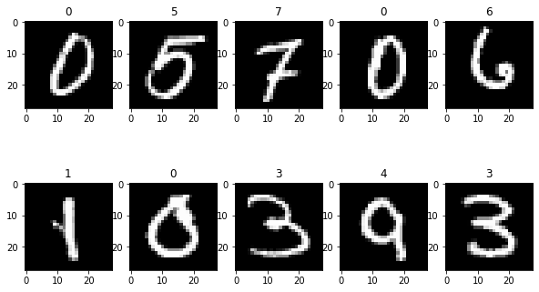
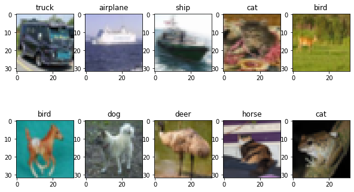

<h1 style="text-align:center">Implementing Convolutional Neural Networks in tensorflow and keras</h1>


We want to implement a Convolutional Neural Network (CNN) for image recognition. For this we will use two well-known datasets, the first simpler and the second more complicated:


## Prerequisites
You need to install TensorFlow 1.13.1 and Keras module 
- Installing TensorFlow with conda 
    
```console
    $ conda create -n tensorflow  python=3.5
    $ activate tensorflow
    $ pip install --ignore-installed --upgrade tensorflow
```
- Installing Keras
 ```console
    $ pip install keras
```


## Dataset 
 - The [CIFAR-10](https://www.cs.toronto.edu/~kriz/cifar.html.
) dataset consists of 60000 32x32 colour images in 10 classes, with 6000 images per class. There are 50000 training images and 10000 test images.

 - The MINST is a dataset of 60,000 small square 28×28 pixel grayscale images of handwritten single digits between 0 and 9.


## CNN  Architecture : 
* We will first implement the simple ConvNet described below using [tensorflow](https://www.tensorflow.org) envirement , then do the same using [keras](https://keras.io.)

	- The input of the CNN is a set of (m,n,3) image tensors (m and n depend on the dataset).
	- We apply 
	   	- a Convolutional layer of 32 filters of shape (3,3), with stride (1,1) and padding='same' (i.e. we do not apply zero-padding)
	    - additive biases
	    - a ReLu activation function
	    
	    - a Convolutional layer of 32 filters of shape (3,3), with stride (1,1) and padding='same' (i.e. we do not apply zero-padding)
	    - additive biases
	    - a ReLu activation function
	    - a Max Pooling Layer of shape (2,2) and stride (2,2) (i.e. we reduce by two the size in each dimension)
	    
	    - a Convolutional layer of 32 filters of shape (3,3), with stride (1,1) and padding='same' (i.e. we do not apply zero-padding)
	    - additive biases
	    - a ReLu activation function
	    - a Max Pooling Layer of shape (2,2) and stride (2,2) (i.e. we reduce by two the size in each dimension)
	    
	    - We then Flatten the data (reduce them to a vector in order to be able to apply a Fully-Connected layer to it)
	    - A softmax activation function which outputs are the $P(y_c | X)$ (multi-class problem)


## Results: 
* the simple ConvNet described below using [tensorflow](https://www.tensorflow.org) achived : 
	- On MINST DATASET: 
		- Train Accuracy: 98.5%
		- Test Accuracy: 92.36%
		- Predication exemple: 
		


	- On CIFAR DATESET: 
		- Train Accuracy: 90.51%
		- Test Accuracy: 47.97%
		- Predication exemple:
		

